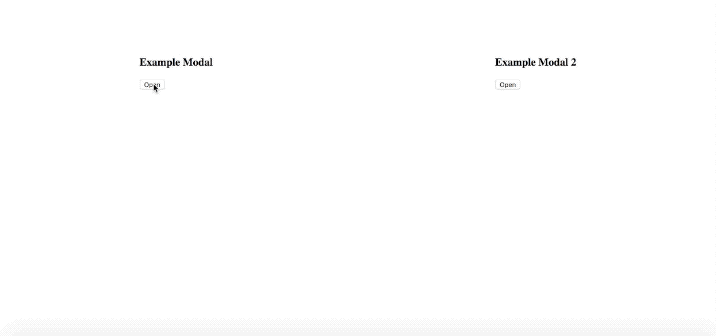

# Introduction

inspired by [the container transform pattern of Material Design motion system](https://www.material.io/design/motion/the-motion-system.html#container-transform)



# usage

```
import React from "react";
import { render } from "react-dom";
import useModal from "../src/useModal";

const ExampleModal = () => {
  const { Modal, open, close } = useModal();

  return (
    <div>
      <h3>Example Modal</h3>
      <p>
        <button onClick={open}>Open</button>
      </p>
      <Modal>
        <div style={styleModalContent}>
          <div style={styleModalHeader}>
            <h5>Title</h5>
            <button style={styleModalClose} onClick={close} type="button">
              <span aria-hidden="true">&times;</span>
            </button>
          </div>
          <div>
            <p style={stylePl}>
              You can also close me by pressing the &quot;ESC&quot; key.
            </p>
          </div>
        </div>
      </Modal>
    </div>
  );
};

const ExampleModal2 = () => {
  const { Modal, open, close } = useModal();

  return (
    <div>
      <h3>Example Modal 2</h3>
      <p>
        <button onClick={open}>Open</button>
      </p>
      <Modal>
        <div style={styleModalContent}>
          <div style={styleModalHeader}>
            <h5>Title</h5>
            <button style={styleModalClose} onClick={close} type="button">
              <span aria-hidden="true">&times;</span>
            </button>
          </div>
          <div>
            <p style={stylePl}>
              You can also close me by pressing the &quot;ESC&quot; key.
            </p>
          </div>
        </div>
      </Modal>
    </div>
  );
};

function App() {
  return (
    <div
      style={{
        display: "flex",
        flexDirection: "row",
        justifyContent: "space-around",
      }}
    >
      <ExampleModal />
      <ExampleModal2 />
    </div>
  );
}

render(<App />, document.getElementById("root"));
```
